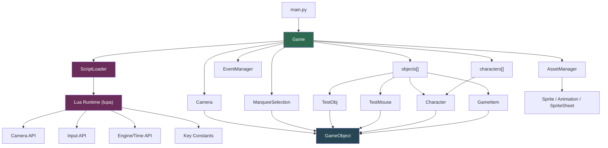

# ALEPH — Documentation

> **Python 3.10.1** · **pygame 2.6.1** · **lupa ≥ 2.0**

---

## Table of Contents

- [Setup](#setup)
- [Project Structure](#project-structure)
- [Architecture Overview](#architecture-overview)
- [Core Module Reference](#core-module-reference)
  - [main.py](#mainpy)
  - [Game.py](#gamepy)
  - [GameObject.py](#gameobjectpy)
  - [Camera.py](#camerapy)
  - [Selection.py](#selectionpy)
  - [Event.py](#eventpy)
  - [AssetManager.py](#assetmanagerpy)
  - [ScriptLoader.py](#scriptloaderpy)
  - [Sprite.py](#spritepy)
  - [Character.py](#characterpy)
  - [Item.py](#itempy)
  - [testObj.py](#testobjpy--testobj--testmouse)
- [Script Reference](#script-reference)
  - [CameraController.lua](#cameracontrollerlua)
  - [TestSystem.lua](#testsystemlua)
- [Controls Reference](#controls-reference)
- [How-To Guides](#how-to-guides)

---

## Setup

```bash
python -m venv .venv
.\.venv\Scripts\Activate.ps1   # PowerShell

pip install -r requirements.txt

cd src
python main.py
```

### requirements.txt

```
pygame==2.6.1
lupa>=2.0
```

> [!IMPORTANT]
> **Python 3.10.1** is required. `lupa` provides the Lua 5.4 runtime
> embedded in Python via LuaJIT/CPython bindings.

---

## Project Structure

```
ALEPH/
├── Asset/
│   ├── Audio/              # SFX & music
│   ├── Character/          # Character sprites & sprite sheets
│   └── Items/              # Item sprites
├── src/
│   ├── main.py             # Entry point
│   ├── Core/               # All Python engine code
│   │   ├── Game.py
│   │   ├── GameObject.py
│   │   ├── Camera.py
│   │   ├── Selection.py
│   │   ├── Event.py
│   │   ├── AssetManager.py
│   │   ├── ScriptLoader.py
│   │   ├── Sprite.py
│   │   ├── Character.py
│   │   ├── Item.py
│   │   └── testObj.py
│   └── Script/             # Lua scripts (auto-discovered at startup)
│       ├── CameraController.lua
│       └── TestSystem.lua
├── .gitignore
└── requirements.txt
```

---

## Architecture Overview



**Frame lifecycle:**

```
Game.gameLoop()
  ├── eventHandle()     ← poll events, handle VIDEORESIZE, feed EventManager
  ├── update()          ← keyPressed, camera.update(), obj.update() × N,
  │                        ScriptLoader.update(dt)   ← Lua update() per script
  └── draw()            ← fill, obj.draw() × N, selection.draw(), flip
```

**Two object lists:**

| List | Purpose |
|---|---|
| `game.objects` | Everything updated + drawn each frame |
| `game.characters` | Subset selectable by marquee |

---

## Core Module Reference

---

### main.py

`main.py` · 6 lines

**Purpose:** Entry point.

```python
from Core.Game import Game
if __name__ == "__main__":
    window = Game()
    window.gameLoop()
```

---

### Game.py

`Game.py` · 237 lines

**Purpose:** Central hub. Owns all subsystems, runs the loop, shows a
loading screen during startup.

#### Class `Game`

| Attribute | Type | Description |
|---|---|---|
| `surface` | `pygame.Surface` | Main display (default 1280×720, **resizable**) |
| `project_name` | `str` | Window title prefix (`"ALEPH - DEV"`) |
| `running` | `bool` | `False` to exit |
| `keyPressed` | `ScancodeWrapper` | Key snapshot (updated each frame) |
| `dt` | `float` | Delta-time in seconds |
| `scrolling` | `int` | Mouse-wheel delta (per-frame impulse) |
| `mouseButtonDown` | `int` | Mouse button id (per-frame impulse) |
| `mouseClickPosition` | `tuple[int, int]` | Position of last right-click |
| `camera` | `Camera` | World-space camera |
| `selection` | `MarqueeSelection` | Rubber-band selection |
| `eventManager` | `EventManager` | Event dispatcher |
| `AssetManager` | `AssetManager` | Asset cache |
| `ScriptLoader` | `ScriptLoader` | Lua runtime |
| `objects` | `list[GameObject]` | All entities |
| `characters` | `list` | Selectable entities |
| `fps` | `int` | Target framerate (120) |
| `clock` | `pygame.time.Clock` | Frame clock |

#### Methods

| Method | Description |
|---|---|
| `gameLoop()` | Main loop: eventHandle → update → draw → set FPS caption. |
| `eventHandle()` | Polls events; handles `VIDEORESIZE` (re-creates surface), `MOUSEWHEEL`, `MOUSEBUTTONDOWN/UP`, forwards all to `eventManager`. |
| `update()` | Refreshes keys, updates camera, all objects, then calls `ScriptLoader.update(dt)`. |
| `draw()` | Fills dark blue, draws all objects, draws selection, flips display. |
| `onQuit(event)` | Sets `running = False`. |
| `quit()` | Calls `pygame.quit()`. |
| `_draw_loading_screen(progress, label)` | Renders a progress bar with project name, percentage, and label. |
| `_load_assets()` | Iterates loading steps with labels, pumps events between steps to keep the OS responsive. |
| `_load_grid()` | Creates `TestObj` and appends to `objects`. |
| `_load_character()` | Creates `Character` + `GameItem`, appends to lists. |
| `_load_mouse()` | Creates `TestMouse`, registers its MOUSEMOTION event. |

> [!NOTE]
> **Init order:** `AssetManager` and `ScriptLoader` are created before
> everything else. `Camera` and game objects are created inside
> `_load_assets()` during the loading screen, so sprites and scripts
> are available immediately during entity `__init__`.

> [!NOTE]
> The window is created with `pygame.RESIZABLE`. `VIDEORESIZE` events are
> handled in both `_load_assets()` (during loading) and `eventHandle()`
> (during play), so the surface reference always reflects the current size.

---

### GameObject.py

`GameObject.py` · 177 lines

**Purpose:** Base class for all world entities. Provides world position,
drawing helpers, frustum culling, and a Level-of-Detail (LOD) system.

#### Class `GameObject`

| Attribute | Type | Default | Description |
|---|---|---|---|
| `x, y` | `float` | `0` | World-space position |
| `game` | `Game` | — | Back-reference |
| `model` | `pygame.Surface \| None` | `None` | Current sprite frame |
| `size` | `int \| tuple` | `0` | Logical size in world units |
| `lods` | `list` | `[]` | List of `(scale_threshold, Sprite)` pairs |
| `current_lod_sprite` | `Sprite \| None` | `None` | Active LOD sprite |

> [!NOTE]
> `screen_width`, `screen_height`, `screen_center_x`, `screen_center_y`
> are now **`@property`** values — they query `game.surface` live, so
> resizing the window is automatically reflected.

#### Drawing & Query Methods

| Method | Signature | Returns | Description |
|---|---|---|---|
| `getPositionOnScreen()` | `()` | `(float, float)` | Projects `(x, y)` to screen coords. |
| `getSizeScaleOnScreen()` | `()` | `float` | Current zoom scale factor. |
| `isOnScreen()` | `(sx, sy, w, h)` | `bool` | Frustum cull: returns `True` if the rect overlaps the screen. |
| `drawModel()` | `()` | — | Blits `self.model` at the projected position. Skips if off-screen. Caches scaled surface to avoid redundant transforms. |
| `drawRect()` | `(color, size, offset=(0,0), border_width=-1)` | — | Draws a camera-projected rect. `size` can be scalar or tuple. |
| `draw()` | `()` | — | Override in subclass. |
| `update()` | `()` | — | Override in subclass. |

#### LOD System

```python
obj.add_lod(scale_threshold=1.5, sprite=high_res_sprite)
obj.add_lod(scale_threshold=0.5, sprite=low_res_sprite)

# In update():
obj.update_lod()    # selects appropriate LOD sprite for current zoom
```

| Method | Description |
|---|---|
| `add_lod(scale_threshold, sprite)` | Registers a LOD level. Entries are sorted descending by threshold. |
| `update_lod()` | Picks the LOD whose threshold is ≤ the current scale. When the LOD changes, animation state (frame index, timer) is transferred to the new sprite. |

#### `drawModel` Optimisations

- **Frustum culling** — skips `blit` if the scaled rect is entirely off-screen.
- **Scale cache** — stores `(id(model), w, h)` as a cache key; rescales only when the source surface or target size changes.
- **Quality** — uses `smoothscale` when zoomed in (scale ≥ 1), `scale` when zoomed out.

---

### Camera.py

`Camera.py` · 31 lines

**Purpose:** Data-only camera object. Position and zoom are now driven
entirely by `CameraController.lua` via `ScriptLoader`. No `update()` logic
remains in Python.

#### Class `Camera` (extends `GameObject`)

| Attribute | Type | Default | Description |
|---|---|---|---|
| `x, y` | `float` | `0` | Camera world position |
| `fov` | `float` | `0` | Zoom level (`-8` to `+8`) |
| `mx_fov` | `int` | `8` | Max zoom magnitude |
| `mouse_rel` | `tuple \| None` | `None` | Drag delta (managed by script) |
| `prev_cam_pos` | `tuple \| None` | `None` | Drag origin (managed by script) |
| `controlled_by_script` | `bool` | `True` | Flag for script ownership |

| Method | Returns | Description |
|---|---|---|
| `onChangeFov()` | — | Clamps `fov` to `[-mx_fov, mx_fov]`. |
| `getWorldMousePos()` | `(float, float)` | Converts mouse screen coords to world coords. |

> [!NOTE]
> Camera movement is handled entirely by `CameraController.lua`. The
> Python class only stores state and exposes `getWorldMousePos()` /
> `onChangeFov()` for use by both the engine and the Lua API.

---

### Selection.py

`Selection.py` · 65 lines

**Purpose:** Marquee rubber-band selection over `game.characters`.

#### Class `MarqueeSelection` (extends `GameObject`)

| Attribute | Type | Default | Description |
|---|---|---|---|
| `is_selecting` | `bool` | `False` | `True` while LMB is held |
| `selection_start` | `tuple` | `(0,0)` | Screen pos on LMB down |
| `selection_end` | `tuple` | `(0,0)` | Cursor pos during drag |
| `selected_objects` | `list` | `[]` | Entities selected by last action |

#### Selection Behaviour

| Gesture | Condition | Behaviour |
|---|---|---|
| Click (no drag) | `width == 0 or height == 0` | **Toggle** `is_selected` on character under cursor (`collidepoint`) |
| Drag (marquee) | `width > 0 and height > 0` | **Set** `is_selected = True` on all overlapping characters (`colliderect`), deselect others |

> [!NOTE]
> `size` can now be a `tuple` or scalar. Selection unpacks it accordingly
> when computing each character's bounding rect.

---

### Event.py

`Event.py` · 42 lines

**Purpose:** Lightweight pub/sub event dispatcher.

#### Class `Event`

| Attribute | Type | Description |
|---|---|---|
| `game` | `Game` | Back-reference |
| `eventType` | `int` | pygame event type constant |
| `callback` | `callable` | `fn(event)` receiving the raw pygame event |

#### Class `EventManager`

| Method | Description |
|---|---|
| `addEvent(event)` | Register an `Event` by type. |
| `update(event)` | Dispatch all callbacks for the event's type. |

```python
game.eventManager.addEvent(Event(game, pygame.KEYDOWN, my_fn))
```

---

### AssetManager.py

`AssetManager.py` · 341 lines

**Purpose:** Lazy-loading cache for images, animated sprites, SFX,
streamed music, and fonts.

#### Module Constants

| Constant | Formats |
|---|---|
| `IMAGE_EXTS` | `.png .jpg .jpeg .bmp .gif .tga .webp` |
| `SFX_EXTS` | `.wav .ogg .flac` |
| `MUSIC_EXTS` | `.mp3 .ogg .mid .midi .mod .xm` |
| `FONT_EXTS` | `.ttf .otf` |

> [!NOTE]
> `ASSET_DIR` is now resolved two levels up from `Core/` to reach the
> project root's `Asset/` folder: `../../Asset`.

#### Methods — Images

| Method | Description |
|---|---|
| `image(key, alpha=True)` | Load & cache a `Surface`. |
| `image_scaled(key, size, alpha=True)` | New scaled copy (base image still cached). |
| `unload_image(key)` | Evict one image. |
| `preload_images(*keys, alpha=True)` | Batch-load. |
| `clear_images()` | Evict all images. |

#### Methods — Sprites & Animations *(new)*

| Method | Description |
|---|---|
| `spritesheet(key, alpha=True)` | Returns a `SpriteSheet` for *key*. |
| `animation(key, cols, rows, fps=12, loop=True, ...)` | Extracts frames from a grid and returns an `Animation`. |
| `animated_sprite(key, cols, rows, fps=12, loop=True, ..., animation_name="default")` | Full pipeline: load sheet → extract frames → return a ready `Sprite`. |

```python
sprite = game.AssetManager.animated_sprite(
    "Character/la_manchaland_sprite",
    cols=10, rows=6, fps=24.0, scale_size=(100, 100)
)
```

#### Methods — SFX, Music, Fonts

_(unchanged from previous version — see below)_

| Method | Description |
|---|---|
| `sfx(key)` / `play_sfx(key, volume, loops)` / `stop_sfx(key)` | Sound effects |
| `play_music(key, loops, volume, start, fade_ms)` / `stop_music(fade_ms)` / `pause_music()` / `resume_music()` / `set_music_volume(v)` | Streamed music |
| `font(key, size)` / `sysfont(name, size)` | Fonts |
| `clear_all()` | Evict everything |

---

### ScriptLoader.py

`ScriptLoader.py` · 313 lines

**Purpose:** Embeds a Lua 5.4 runtime via `lupa`, binds engine APIs as
Lua globals, and manages loading + per-frame update of all Lua modules.

#### Class `ScriptLoader`

| Attribute | Type | Description |
|---|---|---|
| `game` | `Game` | Back-reference |
| `lua` | `LuaRuntime` | lupa Lua runtime (`unpack_returned_tuples=True`) |
| `modules` | `dict[str, lua_table]` | Loaded Lua modules keyed by filename stem |

#### Methods

| Method | Description |
|---|---|
| `_bind_engine_apis()` | Registers all Lua globals (`Camera`, `Input`, `Engine`, `Time`, `Key`) at init. |
| `load_all()` | Scans `src/Script/` and calls `load_script()` for every `.lua` file. Creates the directory if missing. |
| `load_script(filename)` | Executes one Lua file, stores the returned table, calls `module.init()` if present. |
| `update(delta_time)` | Calls `module.update(dt)` on every loaded module. Errors are caught and printed. |

#### Lua Global APIs

**`Camera`**

| Function | Description |
|---|---|
| `Camera.get_pos()` / `get_position()` | Returns `x, y` |
| `Camera.set_pos(x, y)` / `set_position(x, y)` | Set camera position |
| `Camera.move(dx, dy)` / `pan(dx, dy)` | Relative move |
| `Camera.get_fov()` | Returns current fov |
| `Camera.set_fov(fov)` | Set fov (clamped) |
| `Camera.change_fov(dfov)` / `zoom(dfov)` | Add to fov (clamped) |
| `Camera.get_max_fov()` | Returns `mx_fov` |
| `Camera.get_scale()` | Returns `max(0.1, 1 + fov*0.1)` |
| `Camera.get_world_mouse_pos()` | Mouse in world coords |
| `Camera.screen_to_world(sx, sy)` | Screen → World |
| `Camera.world_to_screen(wx, wy)` | World → Screen |
| `Camera.reset()` | x=0, y=0, fov=0 |

**`Input`**

| Function | Description |
|---|---|
| `Input.is_key_pressed(key)` / `is_key_down(key)` | Key held? Accepts string (`"w"`, `"space"`) or pygame int |
| `Input.get_mouse_pos()` | Returns `mx, my` (screen) |
| `Input.is_mouse_pressed(button)` / `is_mouse_down(button)` | Button held? `1/2/3` or `"left"/"middle"/"right"` |
| `Input.get_mouse_rel()` | Returns `dx, dy` since last frame |
| `Input.get_scroll()` / `get_mouse_wheel()` | Mouse wheel delta |
| `Input.get_mouse_click_pos()` | Last right-click position |
| `Input.get_mouse_button_down()` | `game.mouseButtonDown` value |

**`Engine` / `Time`**

| Function | Description |
|---|---|
| `Engine.get_dt()` | Delta-time in seconds |
| `Engine.get_fps()` | Actual FPS |
| `Engine.get_screen_size()` | Returns `w, h` |
| `Engine.get_screen_center()` | Returns `cx, cy` |
| `Engine.log(...)` | Print with `[Debug/Lua]` prefix |

**`Key`** — Named constants: `Key.W`, `Key.A`, `Key.S`, `Key.D`, `Key.SPACE`, `Key.SHIFT`, `Key.CTRL`, `Key.ESCAPE`, etc.

> [!NOTE]
> `print` in Lua is remapped to `Engine.log` — all Lua output is prefixed
> with `[Debug/Lua]:`.

> [!TIP]
> To add a new API namespace, add a `lua.table_from({...})` block to
> `_bind_engine_apis()`. No restart required for new scripts — just
> add the `.lua` file and re-run.

---

### Sprite.py

`Sprite.py` · 640 lines

**Purpose:** Three-layer sprite system: raw sheet extraction (`SpriteSheet`),
frame animation (`Animation`), and high-level controller (`Sprite`).

---

#### Class `SpriteSheet`

Wraps a `pygame.Surface` and extracts frames.

| Method | Description |
|---|---|
| `from_asset(asset_manager, key, alpha=True)` | Class method — load from `AssetManager`. |
| `get_frame(x, y, width, height, scale_size=None)` | Extract one frame by pixel rect. |
| `get_frame_by_index(col, row, fw, fh, scale_size, margin, spacing)` | Extract by grid position. |
| `get_frames_grid(cols, rows, frame_count, scale_size, margin, spacing)` | Extract all frames left-to-right, top-to-bottom. |
| `get_row_frames(row, cols, rows, ...)` | Extract one full row. |
| `get_col_frames(col, cols, rows, ...)` | Extract one full column. |

---

#### Class `Animation`

Manages frame playback, timing, and looping for a list of surfaces.

| Attribute | Type | Description |
|---|---|---|
| `frames` | `list[Surface]` | Frame sequence |
| `fps` | `float` | Playback speed |
| `loop` | `bool` | Loop when finished |
| `playback_speed` | `float` | Speed multiplier |
| `on_finish` | `callable \| None` | Called when non-looping animation ends |
| `current_frame_index` | `int` | Active frame |
| `timer` | `float` | Accumulator |
| `is_playing` | `bool` | Playback state |
| `is_finished` | `bool` | True after non-looping completes |

| Method | Description |
|---|---|
| `update(dt)` | Advance by `dt`, return current frame. |
| `play()` | Resume or restart if finished. |
| `pause()` | Freeze at current frame. |
| `stop()` | Freeze and rewind. |
| `restart()` | Rewind and play. |
| `set_frame(index)` | Jump to frame. |
| `scaled(size)` | Return new `Animation` with all frames scaled. |
| `flipped(flip_x, flip_y)` | Return new `Animation` with all frames flipped. |
| `copy()` | Return independent copy. |

---

#### Class `Sprite`

High-level controller: named animation library + flip support.

| Property | Description |
|---|---|
| `current_animation` | Active `Animation` or `None` |
| `current_animation_name` | Name string or `None` |
| `current_frame` | Current `Surface` with flip applied |
| `model` | Alias for `current_frame` (matches `GameObject.model`) |
| `is_playing` | Whether active animation is playing |
| `is_finished` | Whether active animation has finished |
| `flip_x`, `flip_y` | Flip flags applied to every frame |

| Method | Description |
|---|---|
| `add_animation(name, animation)` | Register a named `Animation`. |
| `play(name=None, restart=False)` | Switch to or resume animation. |
| `pause()` / `stop()` / `restart()` | Playback control. |
| `set_frame(index)` | Jump to frame in current animation. |
| `update(dt)` | Advance animation, return current frame. |
| `draw(surface, dest)` | Blit current frame to a surface. |
| `from_grid(...)` | Class method — create Sprite from a grid sheet. |

#### Convenience Functions

```python
from Core.Sprite import load_spritesheet, load_animation, load_sprite

sheet  = load_spritesheet(game.AssetManager, "Character/la_manchaland_sprite")
anim   = load_animation(game.AssetManager, "Character/la_manchaland_sprite", cols=10, rows=6, fps=24)
sprite = load_sprite(game.AssetManager, "Character/la_manchaland_sprite", cols=10, rows=6, fps=24)
```

---

### Character.py

`Character.py` · 50 lines

**Purpose:** A selectable character entity with a static model, an animated
sprite, and LOD support.

#### Class `Character` (extends `GameObject`)

| Attribute | Type | Description |
|---|---|---|
| `w, h` | `int` | Source sprite sheet dimensions (1227 × 554) |
| `size` | `tuple[int,int]` | Render size `(100, 100)` |
| `model` | `Surface` | Static preview image |
| `is_selected` | `bool` | Set by `MarqueeSelection` |
| `sprite` | `Sprite` | Animated sprite (24 fps, 10×6 grid) |

| Method | Description |
|---|---|
| `draw()` | Draws `model` + selection outline (uses `isOnScreen` for culling). |
| `update()` | No-op (override to add behaviour). |
| `updateSprite()` | Advances `sprite`, updates `model` from its current frame, calls `update_lod()`. |

---

### Item.py

`Item.py` · 40 lines

**Purpose:** A selectable item entity (e.g. inventory item on the game
world).

#### Class `GameItem` (extends `GameObject`)

| Attribute | Type | Description |
|---|---|---|
| `size` | `tuple[int,int]` | Render size `(80, 120)` |
| `model` | `Surface` | Loaded from `Items/khoga` |
| `is_selected` | `bool` | Set by `MarqueeSelection` |

| Method | Description |
|---|---|
| `draw()` | Draws model + selection outline with frustum cull. |
| `update()` | No-op. |
| `updateSprite()` | Sprite + LOD update (mirrors `Character.updateSprite`). |

---

### testObj.py — TestObj & TestMouse

`testObj.py` · 92 lines

---

#### Class `TestObj` (extends `GameObject`)

A **frustum-culled infinite grid** that only draws cells visible in the
current viewport.

| Attribute | Default | Description |
|---|---|---|
| `size` | `100` | Cell size in world units |
| `_grid_min` | `-3` | Min grid index on each axis |
| `_grid_max` | `+3` | Max grid index on each axis |

`draw()` computes the world-space viewport bounds from the camera, converts
to grid indices, clamps to `[_grid_min, _grid_max]`, and draws only the
visible subset — constant-time regardless of grid size.

---

#### Class `TestMouse` (extends `GameObject`)

White circle tracking the mouse in world space via `Camera.getWorldMousePos()`.

| Attribute | Default | Description |
|---|---|---|
| `size` | `5` | Circle radius (world units) |
| `test_event` | — | `MOUSEMOTION` → `onMouseMove()` |

| Method | Description |
|---|---|
| `onMouseMove(event)` | Updates `(x, y)` to world mouse position. |
| `draw()` | Circle scaled by zoom at projected screen position. |

---

## Script Reference

---

### CameraController.lua

`src/Script/CameraController.lua` · 126 lines

Replaces the old Python camera `update()`. Fully controls camera panning,
zooming, and reset. All behaviour is configurable via `CameraController.config`.

#### Config Table

| Key | Default | Description |
|---|---|---|
| `speed` | `300.0` | Base pan speed (world units/sec) |
| `fast_speed_multiplier` | `2.5` | Shift-held speed boost |
| `zoom_speed` | `8.0` | Keyboard zoom speed |
| `wheel_zoom_speed` | `40.0` | Mouse wheel zoom factor |
| `enable_keyboard` | `true` | WASD + Arrow panning |
| `enable_mouse_drag` | `true` | Right-click drag panning |
| `enable_zoom` | `true` | +/- and scroll zoom |
| `enable_reset` | `true` | R key reset |

#### Behaviour

1. **Keyboard Pan** — `W/S/A/D` or Arrow keys; speed is `config.speed / scale * dt`. `Shift` multiplies by `fast_speed_multiplier`.
2. **Mouse Drag** — Right-click captures start position + camera origin; drag computes the delta offset divided by scale.
3. **Zoom** — `+`/`-` keys use `change_fov`; mouse wheel multiplies delta by `wheel_zoom_speed * dt`.
4. **Reset** — `R` calls `Camera.reset()`.

---

### TestSystem.lua

`src/Script/TestSystem.lua` · 7 lines

Minimal template demonstrating the module convention.

```lua
local TestSystem = {}
function TestSystem.init()
    print("Init TestSystem!")
end
return TestSystem
```

No `update()` — only `init()` runs at load time.

---

## Controls Reference

| Input | Action |
|---|---|
| `W / A / S / D` or Arrow keys | Pan camera |
| `Shift` + pan | Fast pan (×2.5) |
| `+` / `-` | Zoom in / out |
| Mouse wheel | Zoom (faster) |
| Right-click drag | Pan camera |
| `R` | Reset camera to origin |
| Left-click drag | Marquee select |
| Left-click (no drag) | Toggle select single character |

---

## How-To Guides

### Add a New Entity

```python
# src/Core/MyEntity.py
from Core.GameObject import GameObject

class MyEntity(GameObject):
    def __init__(self, game, x=0, y=0):
        super().__init__(game)
        self.x, self.y = x, y
        self.size = (64, 64)
        self.model = game.AssetManager.image_scaled("Character/don_quixote", self.size)

    def update(self): pass

    def draw(self):
        sx, sy = self.getPositionOnScreen()
        scale  = self.getSizeScaleOnScreen()
        sw = int(self.size[0] * scale)
        sh = int(self.size[1] * scale)
        if self.isOnScreen(sx, sy, sw, sh):
            self.drawModel()
            self.drawRect((255, 255, 255), self.size, border_width=2)
```

Register in `Game._load_character()`:
```python
from Core.MyEntity import MyEntity
e = MyEntity(self, x=200, y=0)
self.objects.append(e)
self.characters.append(e)  # if selectable
```

### Add LOD Levels to an Entity

```python
# In __init__:
hi = game.AssetManager.animated_sprite("Character/sheet_hi", cols=10, rows=6, fps=24, scale_size=(100,100))
lo = game.AssetManager.animated_sprite("Character/sheet_lo", cols=5,  rows=3, fps=12, scale_size=(100,100))
self.add_lod(scale_threshold=1.0, sprite=hi)  # use hi-res when scale >= 1.0
self.add_lod(scale_threshold=0.0, sprite=lo)  # fall back to lo-res

# In update():
self.update_lod()
if self.current_lod_sprite:
    self.current_lod_sprite.update(self.game.dt)
    self.model = self.current_lod_sprite.current_frame
```

### Add a New Lua Script

Create `src/Script/MySystem.lua`:

```lua
local MySystem = {}

function MySystem.init()
    Engine.log("MySystem ready")
end

function MySystem.update(dt)
    if Input.is_key_pressed(Key.SPACE) then
        Camera.reset()
    end
end

return MySystem
```

It is discovered and loaded automatically on next run.

### Register a Custom Python Event

```python
from Core.Event import Event

def on_key(event):
    if event.key == pygame.K_F1:
        print("F1 pressed")

game.eventManager.addEvent(Event(game, pygame.KEYDOWN, on_key))
```
