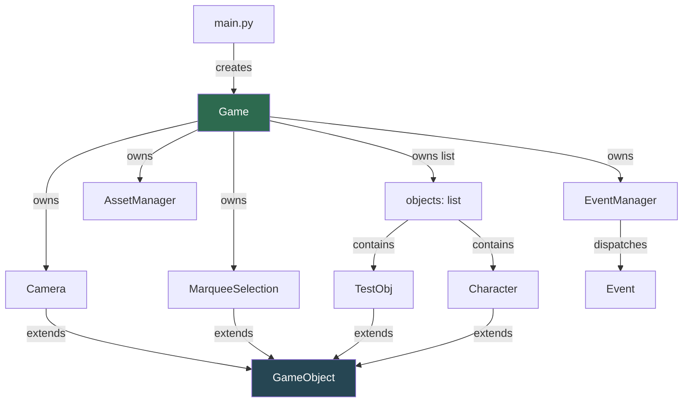
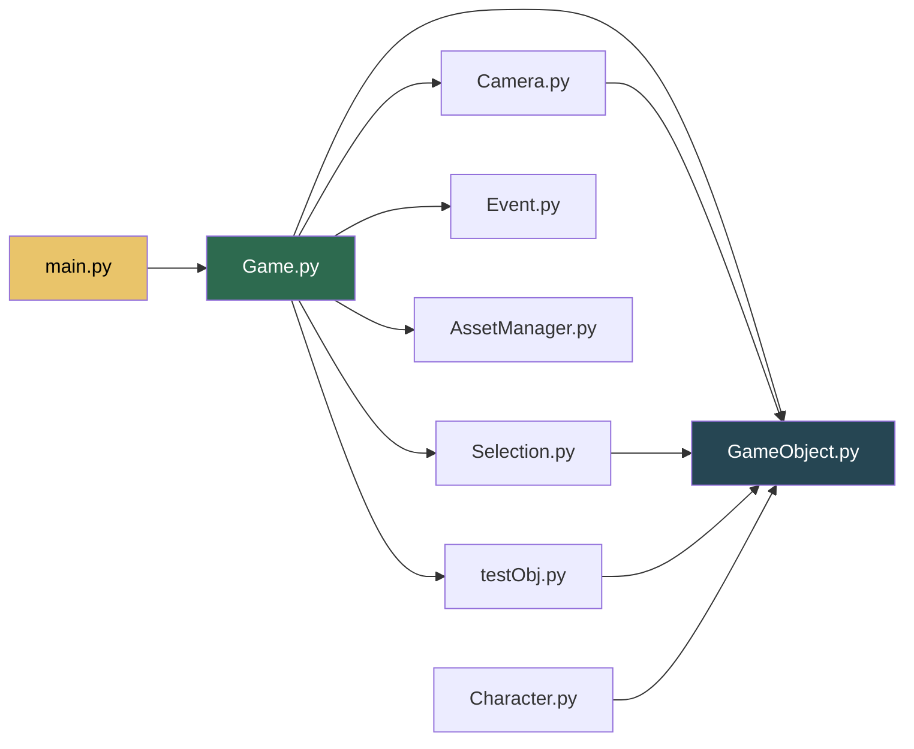

# ALEPH — Project Documentation

> **Python 3.10.1** · **pygame 2.6.1**

A 2D game framework built on pygame featuring a zoomable/pannable camera,
marquee selection, an event dispatcher, and a centralised asset manager.

---

## Table of Contents

- [Setup](#setup)
- [Project Structure](#project-structure)
- [Architecture Overview](#architecture-overview)
- [File-by-File Reference](#file-by-file-reference)
  - [main.py](#mainpy)
  - [Game.py](#gamepy)
  - [GameObject.py](#gameobjectpy)
  - [Camera.py](#camerapy)
  - [Selection.py](#selectionpy)
  - [Event.py](#eventpy)
  - [AssetManager.py](#assetmanagerpy)
  - [Character.py](#characterpy)
  - [testObj.py](#testobjpy)
- [Dependency Graph](#dependency-graph)
- [Controls Reference](#controls-reference)
- [How-To Guides](#how-to-guides)

---

## Setup

```bash
# 1.  Create a virtual environment  (Python 3.10.1 required)
python -m venv .venv

# 2.  Activate it
#     Windows PowerShell:
.\.venv\Scripts\Activate.ps1
#     Windows CMD:
.\.venv\Scripts\activate.bat

# 3.  Install dependencies
pip install -r requirements.txt

# 4.  Run
cd src
python main.py
```

### requirements.txt

```
pygame==2.6.1
```

> [!IMPORTANT]
> This project targets **Python 3.10.1** exclusively. Type hints in
> `AssetManager.py` use `dict[K, V]` and `tuple[...]` (PEP 585, available
> since 3.9) and `X | None` union syntax (PEP 604, available since 3.10).

---

## Project Structure

```
ALEPH/
├── Asset/                  # All game assets live here
│   ├── Audio/              #   SFX & music files
│   └── Character/          #   Sprites
│       └── don_quixote.png
├── src/                    # Source code
│   ├── main.py             #   Entry point
│   ├── Game.py             #   Core game loop & subsystem wiring
│   ├── GameObject.py       #   Base class for world entities
│   ├── Camera.py           #   Pan & zoom camera
│   ├── Selection.py        #   Marquee (rubber-band) selection
│   ├── Event.py            #   Event / EventManager dispatcher
│   ├── AssetManager.py     #   Lazy-loading asset cache
│   ├── Character.py        #   Character entity (extends GameObject)
│   └── testObj.py          #   Debug grid object (extends GameObject)
├── requirements.txt
└── .venv/
```

---

## Architecture Overview



**Frame lifecycle** — every tick of the game loop:

```
Game.gameLoop()
  ├── eventHandle()      ← poll pygame events, feed EventManager
  ├── update()           ← update camera, then each object
  └── draw()             ← clear screen, draw objects, draw selection, flip
```

---

## File-by-File Reference

---

### main.py

[`main.py`] · 6 lines

**Purpose:** Entry point — creates a `Game` and starts the loop.

```python
from Game import Game

if __name__ == "__main__":
    window = Game()
    window.gameLoop()
```

> [!NOTE]
> `Game.py` also has its own `if __name__` guard at the bottom, so you
> can run either `python main.py` or `python Game.py` during development.

---

### Game.py

[`Game.py`] · 111 lines

**Purpose:** Central hub. Initialises pygame, owns every subsystem, runs
the game loop, and dispatches events.

#### Class `Game`

| Attribute | Type | Description |
|---|---|---|
| `surface` | `pygame.Surface` | The main display (1280 × 720) |
| `running` | `bool` | `False` to exit the loop |
| `keyPressed` | `ScancodeWrapper` | Snapshot of all keys (updated each frame) |
| `dt` | `float` | Delta-time in **seconds** |
| `scrolling` | `int` | Mouse-wheel delta for the current frame |
| `mouseButtonDown` | `int` | Button id while a mouse button is held |
| `mouseRel` | `list[int]` | Mouse relative motion |
| `mouseClickPosition` | `tuple[int, int]` | Position at last right-click |
| `camera` | `Camera` | The world-space camera |
| `selection` | `MarqueeSelection` | Rubber-band selection controller |
| `eventManager` | `EventManager` | Custom event dispatcher |
| `AssetManager` | `AssetManager` | Centralised asset cache |
| `objects` | `list[GameObject]` | All updateable/drawable entities |
| `fps` | `int` | Target framerate (60) |
| `clock` | `pygame.time.Clock` | Frame-rate clock |

#### Methods

| Method | Description |
|---|---|
| `gameLoop()` | Main loop: `eventHandle → update → draw`. Calls `quit()` on exit. |
| `eventHandle()` | Polls pygame events, forwards them to `eventManager.update()`, handles mouse-wheel / mouse-button logic and drives the selection state machine. |
| `update()` | Refreshes `keyPressed`, updates camera, then updates each object. |
| `draw()` | Clears to dark blue `(10, 10, 50)`, draws every object, draws selection overlay, flips display. |
| `onQuit(event)` | Callback registered with `EventManager` for `pygame.QUIT`. Sets `running = False`. |
| `quit()` | Calls `pygame.quit()`. |

> [!NOTE]
> **`eventHandle` notes:**
> - `scrolling` and `mouseButtonDown` are reset to `0` at the top of each
>   frame — they are **per-frame impulse values**, not held state.
> - Left-click starts marquee selection; right-click records position for
>   camera drag.
> - `pygame.QUIT` is handled via `EventManager`, not inline.

---

### GameObject.py

[`GameObject.py`] · 21 lines

**Purpose:** Abstract base for every world entity.

#### Class `GameObject`

| Attribute | Type | Default | Description |
|---|---|---|---|
| `x` | `float` | `0` | World-space X |
| `y` | `float` | `0` | World-space Y |
| `game` | `Game` | — | Back-reference to the game instance |

#### Methods

| Method | Description |
|---|---|
| `getScreenPosition()` | Returns `(x - camera.x/2, y - camera.y/2)`. |
| `draw()` | Override to render the object. No-op by default. |
| `update()` | Override for per-frame logic. No-op by default. |

> [!WARNING]
> **`getScreenPosition()` uses a different formula** (`camera / 2`) than
> the world→screen projection used elsewhere in the codebase (which is
> `(world - cam) * scale + screen_center`). This method is currently
> unused; if you use it, be aware it won't match Camera/TestObj/Character
> rendering.

---

### Camera.py

[`Camera.py`] · 73 lines

**Purpose:** Viewport controller — pans with WASD / right-click drag,
zooms with `+`/`-` and mouse wheel.

#### Class `Camera` (extends `GameObject`)

| Attribute | Type | Default | Description |
|---|---|---|---|
| `x, y` | `float` | `0` | Camera centre in world-space |
| `fov` | `float` | `0` | Zoom level (`-8` = zoomed out, `+8` = zoomed in) |
| `mx_fov` | `int` | `8` | Absolute max zoom magnitude |
| `mouse_rel` | `tuple or None` | `None` | Accumulated drag delta |
| `prev_cam_pos` | `tuple or None` | `None` | Camera pos when drag started |

#### Methods

| Method | Description |
|---|---|
| `onChangeFov()` | Clamps `fov` to `[-mx_fov, mx_fov]`. |
| `update()` | Reads keyboard/mouse input and updates position + zoom. |

#### Zoom & Projection Maths

```
scale = max(0.1,  1.0 + fov * 0.1)
```

| `fov` | `scale` | Meaning |
|---|---|---|
| `-8` | `0.2` | Zoomed far out (5× smaller) |
| `0` | `1.0` | Default view |
| `+8` | `1.8` | Zoomed in (1.8× larger) |

**Keyboard pan** speed is inversely proportional to scale (`300 / scale`),
so panning feels consistent regardless of zoom.

**Right-click drag** saves the camera position on mouse-down, then on each
frame computes the delta between the saved click position and current mouse
position, divides by scale, and offsets from the saved camera position.

> [!NOTE]
> The drag implementation is **position-based** (not motion-based). It
> stores `prev_cam_pos` once and always offsets from it, so the camera
> snaps back if the mouse returns to the click origin.

---

### Selection.py

[`Selection.py`] · 54 lines

**Purpose:** Rubber-band (marquee) selection drawn while left mouse button
is held.

#### Class `MarqueeSelection` (extends `GameObject`)

| Attribute | Type | Default | Description |
|---|---|---|---|
| `is_selecting` | `bool` | `False` | `True` while dragging |
| `selection_start` | `tuple[int, int]` | `(0, 0)` | Screen pos on mouse-down |
| `selection_end` | `tuple[int, int]` | `(0, 0)` | Tracks cursor during drag |
| `selected_objects` | `list` | `[]` | Objects captured by last selection |

#### Methods

| Method | Description |
|---|---|
| `update()` | Called on mouse-up. Builds a `Rect` from start→end, projects each object to screen, tests `collidepoint`, and sets `obj.is_selected`. |
| `draw()` | While selecting: updates `selection_end` to cursor, draws a green `(100, 255, 100)` rect outline (width 5). |

> [!NOTE]
> Selection currently tests only a **single point** per object (the
> object's top-left screen position). There is commented-out code for
> bounding-box `colliderect` testing — enable it once objects expose a
> `size` attribute.

> [!NOTE]
> `update()` is only called **on mouse-up** (from `Game.eventHandle`),
> not every frame. `draw()` is called every frame by the game loop.

---

### Event.py

[`Event.py`] · 42 lines

**Purpose:** Lightweight pub/sub event dispatcher. Lets subsystems register
callbacks by pygame event type instead of bloating `Game.eventHandle`.

#### Class `Event`

| Attribute | Type | Description |
|---|---|---|
| `game` | `Game` | Back-reference |
| `eventType` | `int` | pygame event constant (e.g. `pygame.QUIT`) |
| `callback` | `callable` | `fn(event)` — receives the raw pygame event |

#### Class `EventManager`

| Attribute | Type | Description |
|---|---|---|
| `game` | `Game` | Back-reference |
| `events` | `dict[int, list[Event]]` | Mapping of event type → listener list |

| Method | Description |
|---|---|
| `addEvent(event)` | Register an `Event`. Creates the list on first use. |
| `update(event)` | Called for **each** raw pygame event. Fires all callbacks registered for that event type. Silently creates an empty list for unseen event types. |

#### Usage Pattern

```python
def on_key_down(event):
    print(event.key)

game.eventManager.addEvent(Event(game, pygame.KEYDOWN, on_key_down))
```

> [!NOTE]
> Callbacks receive the **raw pygame event object** as the only argument
> (not the `Event` wrapper). The `game` reference stored on `Event` is
> available for the caller's convenience but is not passed to the callback
> automatically.

---

### AssetManager.py

[`AssetManager.py`] · 280 lines

**Purpose:** Centralised lazy-loading cache for images, sound effects,
streamed music, and fonts. All paths are resolved relative to the `Asset/`
directory at the project root.

#### Module Constants

| Constant | Value | Description |
|---|---|---|
| `ASSET_DIR` | `../Asset` (relative to this file) | Root folder for all assets |
| `IMAGE_EXTS` | `.png .jpg .jpeg .bmp .gif .tga .webp` | Supported image formats |
| `SFX_EXTS` | `.wav .ogg .flac` | Supported sound effect formats |
| `MUSIC_EXTS` | `.mp3 .ogg .mid .midi .mod .xm` | Supported music formats |
| `FONT_EXTS` | `.ttf .otf` | Supported font formats |

#### Class `AssetManager`

| Attribute | Type | Description |
|---|---|---|
| `game` | `Game` | Back-reference |
| `_images` | `dict[str, Surface]` | Image cache |
| `_sfx` | `dict[str, Sound]` | Sound effect cache |
| `_fonts` | `dict[tuple, Font]` | Font cache, keyed by `(key, size)` |
| `_music_volume` | `float` | Current music volume (0.0–1.0) |
| `_current_music` | `str or None` | Key of the currently loaded music |

#### Methods — Images

| Method | Description |
|---|---|
| `image(key, alpha=True)` | Load & cache a `Surface`. Uses `convert_alpha()` by default. |
| `image_scaled(key, size, alpha=True)` | Returns a **new** scaled copy (base image is still cached). |
| `unload_image(key)` | Remove one image from cache. |
| `preload_images(*keys, alpha=True)` | Batch-load images (for loading screens). |
| `clear_images()` | Evict all cached images. |

#### Methods — SFX

| Method | Description |
|---|---|
| `sfx(key)` | Load & cache a `Sound` object. Call `.play()` on the result. |
| `play_sfx(key, volume=1.0, loops=0)` | Convenience: load + set volume + play. |
| `stop_sfx(key)` | Stop a playing sound. |
| `unload_sfx(key)` | Remove one sound from cache. |
| `preload_sfx(*keys)` | Batch-load sounds. |
| `clear_sfx()` | Evict all cached sounds. |

#### Methods — Music (streaming)

| Method | Description |
|---|---|
| `play_music(key, loops=-1, volume=None, start=0.0, fade_ms=0)` | Stream a music file. `-1` loops = infinite. |
| `stop_music(fade_ms=0)` | Stop music, optionally with fade-out. |
| `pause_music()` | Pause. |
| `resume_music()` | Unpause. |
| `set_music_volume(volume)` | Set volume 0.0–1.0 (clamped). |
| `current_music` *(property)* | Key of the currently loaded track, or `None`. |

#### Methods — Fonts

| Method | Description |
|---|---|
| `font(key, size=16)` | Load a `.ttf/.otf` font. Pass `None` / `""` for pygame default. |
| `sysfont(name, size=16)` | Load a system font by name (e.g. `"arial"`). |
| `clear_fonts()` | Evict all cached fonts. |

#### Methods — Bulk

| Method | Description |
|---|---|
| `clear_all()` | Evict images + SFX + fonts. |

#### Path Resolution

The private method `_resolve(key, extensions)` works like this:

1. If `key` already has a recognised extension → try that exact file.
2. Otherwise, append each extension in the set and return the first match.
3. Raises `FileNotFoundError` with a helpful message if nothing is found.

This means you never hard-code extensions in game code:

```python
# Both work — extension is optional:
assets.image("Character/don_quixote")
assets.image("Character/don_quixote.png")
```

> [!NOTE]
> `pygame.mixer.init()` is called inside `AssetManager.__init__`. If you
> have already called `pygame.init()` (which also initialises the mixer),
> this second call is harmless.

> [!NOTE]
> Music is **streamed**, not cached. Only one music track can play at a
> time (pygame limitation). SFX are fully loaded into memory and can
> overlap.

---

### Character.py

[`Character.py`] · 40 lines

**Purpose:** A game entity that draws a 10×10 grid of white filled
rectangles. Placeholder for a player / NPC character.

#### Class `Character` (extends `GameObject`)

| Attribute | Type | Default | Description |
|---|---|---|---|
| `size` | `int` | `50` | Logical size (unused in `draw()`) |
| `x, y` | `float` | `0` | World position |

#### Methods

| Method | Description |
|---|---|
| `draw()` | Draws 10×10 grid of white rects, camera-projected. |
| `update()` | No-op. |

> [!WARNING]
> `draw()` references `self.cell_size`, but `cell_size` is **never
> defined** on `Character` or its parent `GameObject`. This will raise
> `AttributeError` at runtime. Either add `self.cell_size = ...` in
> `__init__`, or change the reference to `self.size`.

> [!NOTE]
> `Character` is **not registered** in `Game.objects` by default — it
> exists as a template. Import it and append an instance to `game.objects`
> to use it.

---

### testObj.py

[`testObj.py`] · 40 lines

**Purpose:** Development-only grid entity. Draws a 10×10 wireframe grid
to help visualise the camera and world coordinate system.

#### Class `TestObj` (extends `GameObject`)

| Attribute | Type | Default | Description |
|---|---|---|---|
| `cell_size` | `int` | `100` | Size of each grid cell in world units |
| `x, y` | `float` | `0` | World position of the grid origin |

#### Methods

| Method | Description |
|---|---|
| `draw()` | Draws a 10×10 grid of grey `(200, 200, 200)` outlined rects, camera-projected. |
| `update()` | No-op. |

> [!NOTE]
> `TestObj` is instantiated in `Game.__init__` and placed in
> `game.objects` — it renders by default when you run the project.
> The grid helps you verify that panning and zooming behave correctly.

---

## Dependency Graph



All game entities share the same pattern: extend `GameObject`, override
`draw()` and `update()`, register with `game.objects`.

---

## Controls Reference

| Input | Action |
|---|---|
| `W` | Pan camera up |
| `A` | Pan camera left |
| `S` | Pan camera down |
| `D` | Pan camera right |
| `+` / `=` | Zoom in |
| `-` | Zoom out |
| Mouse wheel up | Zoom in (5× speed) |
| Mouse wheel down | Zoom out (5× speed) |
| Right-click drag | Pan camera |
| Left-click drag | Marquee select |

---

## How-To Guides

### Add a New Entity

1. Create `src/MyEntity.py`:

```python
import pygame
from GameObject import GameObject

class MyEntity(GameObject):
    def __init__(self, game, x=0, y=0):
        super().__init__(game)
        self.x = x
        self.y = y

    def update(self):
        # per-frame logic
        pass

    def draw(self):
        cam   = self.game.camera
        scale = max(0.1, 1.0 + cam.fov * 0.1)
        cx    = self.game.surface.get_width()  // 2
        cy    = self.game.surface.get_height() // 2
        sx    = (self.x - cam.x) * scale + cx
        sy    = (self.y - cam.y) * scale + cy

        pygame.draw.circle(self.game.surface, (255, 0, 0), (int(sx), int(sy)), 20)
```

2. Register in `Game.__init__`:

```python
from MyEntity import MyEntity
self.objects.append(MyEntity(self, x=200, y=150))
```

### Register a Custom Event

```python
# Inside any class that has self.game:
from Event import Event

def on_space_press(event):
    if event.key == pygame.K_SPACE:
        print("Space!")

self.game.eventManager.addEvent(Event(self.game, pygame.KEYDOWN, on_space_press))
```

### Load and Draw a Sprite with AssetManager

```python
# In an entity's draw():
sprite = self.game.AssetManager.image("Character/don_quixote")
# scale to desired size
sprite = self.game.AssetManager.image_scaled("Character/don_quixote", (64, 64))

cam   = self.game.camera
scale = max(0.1, 1.0 + cam.fov * 0.1)
cx    = self.game.surface.get_width()  // 2
cy    = self.game.surface.get_height() // 2
sx    = (self.x - cam.x) * scale + cx
sy    = (self.y - cam.y) * scale + cy

self.game.surface.blit(sprite, (sx, sy))
```
