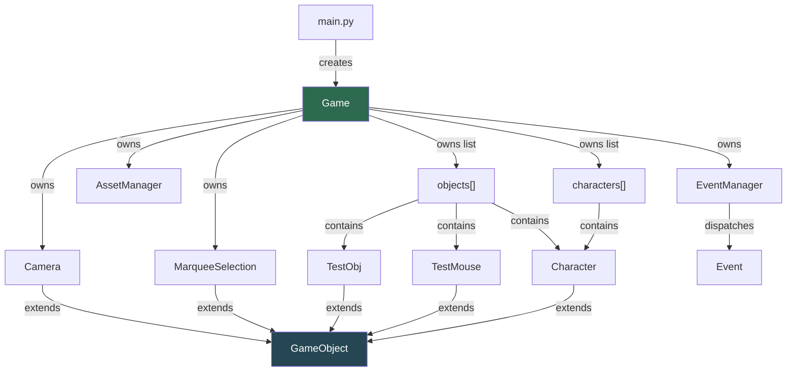
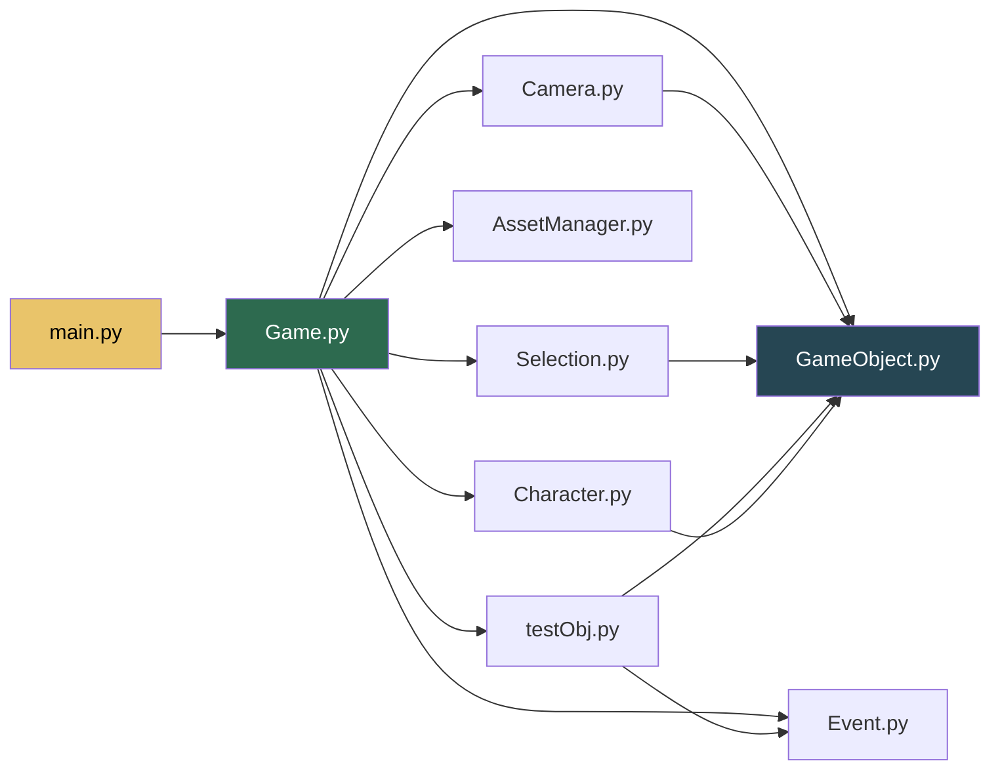

# ALEPH — Documentation

> **Python 3.10.1** · **pygame 2.6.1**

A 2D game framework built on pygame featuring a zoomable/pannable camera,
marquee selection, an event dispatcher, and a centralised asset manager.

---

## Table of Contents

- [Setup](#setup)
- [Project Structure](#project-structure)
- [Architecture Overview](#architecture-overview)
- [File-by-File Reference](#file-by-file-reference)
  - [main.py](#mainpy)
  - [Game.py](#gamepy)
  - [GameObject.py](#gameobjectpy)
  - [Camera.py](#camerapy)
  - [Selection.py](#selectionpy)
  - [Event.py](#eventpy)
  - [AssetManager.py](#assetmanagerpy)
  - [Character.py](#characterpy)
  - [testObj.py](#testobjpy--testobj--testmouse)
- [Dependency Graph](#dependency-graph)
- [Controls Reference](#controls-reference)
- [How-To Guides](#how-to-guides)

---

## Setup

```bash
# 1.  Create a virtual environment  (Python 3.10.1 required)
python -m venv .venv

# 2.  Activate it
#     Windows PowerShell:
.\.venv\Scripts\Activate.ps1
#     Windows CMD:
.\.venv\Scripts\activate.bat

# 3.  Install dependencies
pip install -r requirements.txt

# 4.  Run
cd src
python main.py
```

### requirements.txt

```
pygame==2.6.1
```

> [!IMPORTANT]
> This project targets **Python 3.10.1** exclusively. Type hints use
> `dict[K, V]` and `tuple[...]` (PEP 585, available since 3.9) and
> `X | None` union syntax (PEP 604, available since 3.10).

---

## Project Structure

```
ALEPH/
├── Asset/                  # All game assets live here
│   ├── Audio/              #   SFX & music files
│   └── Character/          #   Sprites
│       └── don_quixote.png
├── src/                    # Source code
│   ├── main.py             #   Entry point
│   ├── Game.py             #   Core game loop & subsystem wiring
│   ├── GameObject.py       #   Base class — position, model, drawing helpers
│   ├── Camera.py           #   Pan & zoom camera + screen↔world conversion
│   ├── Selection.py        #   Marquee (rubber-band) selection
│   ├── Event.py            #   Event / EventManager dispatcher
│   ├── AssetManager.py     #   Lazy-loading asset cache
│   ├── Character.py        #   Character entity (sprite + select outline)
│   └── testObj.py          #   TestObj (debug grid) & TestMouse (cursor dot)
├── .gitignore
└── requirements.txt
```

---

## Architecture Overview



**Frame lifecycle** — every tick of the game loop:

```
Game.gameLoop()
  ├── eventHandle()      ← poll pygame events, feed EventManager
  ├── update()           ← update camera, then each object
  ├── draw()             ← clear screen, draw objects, draw selection, flip
  └── set_caption()      ← update window title with live FPS
```

**Two object lists:**

| List | Purpose |
|---|---|
| `game.objects` | Everything that gets `update()` + `draw()` each frame |
| `game.characters` | Subset of objects that are selectable by marquee |

---

## File-by-File Reference

---

### main.py

`main.py` · 6 lines

**Purpose:** Entry point — creates a `Game` and starts the loop.

```python
from Game import Game

if __name__ == "__main__":
    window = Game()
    window.gameLoop()
```

> [!NOTE]
> `Game.py` also has its own `if __name__` guard, so you can run either
> `python main.py` or `python Game.py` during development.

---

### Game.py

`Game.py` · 124 lines

**Purpose:** Central hub. Initialises pygame, owns every subsystem, runs
the game loop, and dispatches events.

#### Class `Game`

| Attribute | Type | Description |
|---|---|---|
| `surface` | `pygame.Surface` | Main display (1280 × 720) |
| `running` | `bool` | `False` to exit the loop |
| `keyPressed` | `ScancodeWrapper` | Snapshot of all keys (updated each frame) |
| `dt` | `float` | Delta-time in **seconds** |
| `scrolling` | `int` | Mouse-wheel delta for the current frame |
| `mouseButtonDown` | `int` | Button id while a mouse button is held |
| `mouseRel` | `list[int]` | Mouse relative motion |
| `mouseClickPosition` | `tuple[int, int]` | Position at last right-click |
| `camera` | `Camera` | The world-space camera |
| `selection` | `MarqueeSelection` | Rubber-band selection controller |
| `eventManager` | `EventManager` | Custom event dispatcher |
| `AssetManager` | `AssetManager` | Centralised asset cache |
| `objects` | `list[GameObject]` | All updateable/drawable entities |
| `characters` | `list[Character]` | Selectable entities (subset of objects) |
| `fps` | `int` | Target framerate (**120**) |
| `clock` | `pygame.time.Clock` | Frame-rate clock |

#### Methods

| Method | Description |
|---|---|
| `gameLoop()` | Main loop: `eventHandle → update → draw`. Updates window title with live FPS. Calls `quit()` on exit. |
| `eventHandle()` | Polls pygame events, forwards to `eventManager.update()`, handles mouse-wheel / mouse-button logic and drives the selection state machine. |
| `update()` | Refreshes `keyPressed`, updates camera, then updates each object. |
| `draw()` | Clears to dark blue `(10, 10, 50)`, draws every object, draws selection overlay, flips display. |
| `onQuit(event)` | Callback registered with `EventManager` for `pygame.QUIT`. Sets `running = False`. |
| `quit()` | Calls `pygame.quit()`. |

> [!NOTE]
> **Init order matters.** `AssetManager` is created **before** `Camera`,
> `Selection`, and game objects, because entities (like `Character`) load
> assets during `__init__`.

> [!NOTE]
> `scrolling` and `mouseButtonDown` are reset to `0` each frame — they
> are per-frame impulse values, not held state.

---

### GameObject.py

`GameObject.py` · 93 lines

**Purpose:** Base class for every world entity. Provides world position,
an optional sprite (`model`), and camera-aware drawing helpers so
subclasses don't need to recompute projection manually.

#### Class `GameObject`

| Attribute | Type | Default | Description |
|---|---|---|---|
| `x` | `float` | `0` | World-space X |
| `y` | `float` | `0` | World-space Y |
| `game` | `Game` | — | Back-reference to the game instance |
| `screen_width` | `int` | — | Cached `surface.get_width()` |
| `screen_height` | `int` | — | Cached `surface.get_height()` |
| `screen_center_x` | `int` | — | `screen_width // 2` |
| `screen_center_y` | `int` | — | `screen_height // 2` |
| `model` | `pygame.Surface \| None` | `None` | Sprite surface (set by subclass) |
| `size` | `int` | `0` | Logical size in world units |

#### Methods

| Method | Signature | Returns | Description |
|---|---|---|---|
| `getPositionOnScreen()` | `()` | `(float, float)` | Projects `(x, y)` to screen coordinates using the camera's position and zoom. |
| `getSizeScaleOnScreen()` | `()` | `float` | Returns the current zoom scale factor. |
| `drawModel()` | `()` | — | Draws `self.model` at the camera-projected position, scaled by zoom. Uses `smoothscale` when zooming in (scale ≥ 1) and `scale` when zooming out for performance. Silently returns if `model is None`. |
| `drawRect()` | `(color, size, offset=(0,0), border_width=-1)` | — | Draws a camera-projected rectangle. `size` can be an `int`/`float` (square) or a `list`/`tuple` (w, h). `offset` shifts the draw position in screen pixels. `border_width=-1` fills; positive values draw an outline. |
| `draw()` | `()` | — | Override in subclass. No-op by default. |
| `update()` | `()` | — | Override in subclass. No-op by default. |

#### `drawRect` in detail

```python
def drawRect(self, color, size, offset=(0,0), border_width=-1)
```

| Parameter | Type | Default | Description |
|---|---|---|---|
| `color` | `tuple` | — | RGB colour |
| `size` | `int`, `float`, or `tuple`/`list` | — | If scalar → square. If `(w, h)` → rectangle. Automatically scaled by zoom. |
| `offset` | `tuple` or `int`/`float` | `(0, 0)` | Pixel offset added to the projected screen position. Scalar is expanded to `(v, v)`. |
| `border_width` | `int` | `-1` | `-1` = filled rect. Positive = outline thickness. |

> [!NOTE]
> `size` and `offset` accept both scalar and tuple forms — `isinstance`
> checks normalise them internally.

#### World → Screen Projection

All drawing helpers use the same formula:

```
scale    = max(0.1,  1.0 + fov * 0.1)
screen_x = (world_x - camera.x) * scale + screen_center_x
screen_y = (world_y - camera.y) * scale + screen_center_y
```

> [!NOTE]
> `screen_width`, `screen_height`, and `screen_center_*` are computed
> once in `__init__` and cached. If you support window resizing in the
> future, these will need to be recalculated.

> [!TIP]
> **Use the drawing helpers** (`drawModel`, `drawRect`) instead of
> manually computing projection in every entity. They handle zoom
> scaling, null-model guards, and flexible `size`/`offset` types.

---

### Camera.py

`Camera.py` · 82 lines

**Purpose:** Viewport controller — pans with WASD / right-click drag,
zooms with `+`/`-` and mouse wheel. Also provides screen↔world coordinate
conversion.

#### Class `Camera` (extends `GameObject`)

| Attribute | Type | Default | Description |
|---|---|---|---|
| `x, y` | `float` | `0` | Camera centre in world-space |
| `fov` | `float` | `0` | Zoom level (`-8` = zoomed out, `+8` = zoomed in) |
| `mx_fov` | `int` | `8` | Absolute max zoom magnitude |
| `mouse_rel` | `tuple \| None` | `None` | Accumulated drag delta |
| `prev_cam_pos` | `tuple \| None` | `None` | Camera pos when drag started |

#### Methods

| Method | Returns | Description |
|---|---|---|
| `onChangeFov()` | — | Clamps `fov` to `[-mx_fov, mx_fov]`. |
| `getWorldMousePos()` | `(float, float)` | Converts the current mouse screen position to world coordinates. Inverse of the standard projection formula. |
| `update()` | — | Reads keyboard/mouse input and updates position + zoom. |

#### Zoom & Projection Maths

```
scale = max(0.1,  1.0 + fov * 0.1)
```

| `fov` | `scale` | Meaning |
|---|---|---|
| `-8` | `0.2` | Zoomed far out (5× smaller) |
| `0` | `1.0` | Default view |
| `+8` | `1.8` | Zoomed in (1.8× larger) |

**`getWorldMousePos()`** performs the inverse projection:

```
world_x = (mouse_screen_x - screen_center_x) / scale + camera.x
world_y = (mouse_screen_y - screen_center_y) / scale + camera.y
```

**Keyboard pan** speed is inversely proportional to scale (`300 / scale`),
so panning feels consistent regardless of zoom.

**Right-click drag** saves the camera position on mouse-down, then on each
frame offsets from the saved position by the delta between click origin
and current mouse, divided by scale.

---

### Selection.py

`Selection.py` · 58 lines

**Purpose:** Rubber-band (marquee) selection drawn while left mouse button
is held. Iterates over `game.characters` (not `game.objects`) to determine
which entities are selected.

#### Class `MarqueeSelection` (extends `GameObject`)

| Attribute | Type | Default | Description |
|---|---|---|---|
| `is_selecting` | `bool` | `False` | `True` while dragging |
| `selection_start` | `tuple[int, int]` | `(0, 0)` | Screen pos on mouse-down |
| `selection_end` | `tuple[int, int]` | `(0, 0)` | Tracks cursor during drag |
| `selected_objects` | `list` | `[]` | Objects captured by last selection |

#### Methods

| Method | Description |
|---|---|
| `update()` | Called on mouse-up. Builds a `Rect` from start→end, projects each character to screen, tests for intersection. |
| `draw()` | While selecting: updates `selection_end` to cursor, draws a green `(100, 255, 100)` rect outline (width 5). |

#### Selection Behaviour

The `update()` method handles two distinct cases:

| Gesture | Condition | Behaviour |
|---|---|---|
| **Click** (no drag) | `width == 0` or `height == 0` | **Toggle** `is_selected` on the single character under the cursor using `collidepoint`. |
| **Drag** (marquee) | `width > 0` and `height > 0` | **Set** `is_selected = True` for all characters whose bounding rect overlaps the selection rect (`colliderect`). Deselects everything else. |

> [!NOTE]
> Selection iterates over `game.characters`, not `game.objects`. Only
> entities placed in `game.characters` are selectable. Non-character
> objects (like `TestObj`) are never affected.

> [!NOTE]
> Selection uses **full bounding-box** testing (`colliderect`) for
> drag-select and `collidepoint` for click-select, using each object's
> `size` attribute for the bounding rect.

---

### Event.py

`Event.py` · 42 lines

**Purpose:** Lightweight pub/sub event dispatcher. Lets subsystems register
callbacks by pygame event type instead of bloating `Game.eventHandle`.

#### Class `Event`

| Attribute | Type | Description |
|---|---|---|
| `game` | `Game` | Back-reference |
| `eventType` | `int` | pygame event constant (e.g. `pygame.QUIT`) |
| `callback` | `callable` | `fn(event)` — receives the raw pygame event |

#### Class `EventManager`

| Attribute | Type | Description |
|---|---|---|
| `game` | `Game` | Back-reference |
| `events` | `dict[int, list[Event]]` | Mapping of event type → listener list |

| Method | Description |
|---|---|
| `addEvent(event)` | Register an `Event`. Creates the list on first use. |
| `update(event)` | Called for **each** raw pygame event. Fires all callbacks registered for that event type. |

#### Usage Pattern

```python
def on_key_down(event):
    print(event.key)

game.eventManager.addEvent(Event(game, pygame.KEYDOWN, on_key_down))
```

> [!NOTE]
> Callbacks receive the **raw pygame event object** as the only argument
> (not the `Event` wrapper). The `game` reference stored on `Event` is
> available for the caller's convenience but is not passed to the callback
> automatically.

> [!TIP]
> Events can be created by any object and registered from anywhere.
> `TestMouse` demonstrates this pattern — it creates an `Event` in its
> own `__init__` and the `Game` registers it via
> `self.eventManager.addEvent(testMouse.test_event)`.

---

### AssetManager.py

`AssetManager.py` · 280 lines

**Purpose:** Centralised lazy-loading cache for images, sound effects,
streamed music, and fonts. All paths are resolved relative to the `Asset/`
directory at the project root.

#### Module Constants

| Constant | Value | Description |
|---|---|---|
| `ASSET_DIR` | `../Asset` (relative to this file) | Root folder for all assets |
| `IMAGE_EXTS` | `.png .jpg .jpeg .bmp .gif .tga .webp` | Supported image formats |
| `SFX_EXTS` | `.wav .ogg .flac` | Supported sound effect formats |
| `MUSIC_EXTS` | `.mp3 .ogg .mid .midi .mod .xm` | Supported music formats |
| `FONT_EXTS` | `.ttf .otf` | Supported font formats |

#### Class `AssetManager`

| Attribute | Type | Description |
|---|---|---|
| `game` | `Game` | Back-reference |
| `_images` | `dict[str, Surface]` | Image cache |
| `_sfx` | `dict[str, Sound]` | Sound effect cache |
| `_fonts` | `dict[tuple, Font]` | Font cache, keyed by `(key, size)` |
| `_music_volume` | `float` | Current music volume (0.0–1.0) |
| `_current_music` | `str \| None` | Key of the currently loaded music |

#### Methods — Images

| Method | Description |
|---|---|
| `image(key, alpha=True)` | Load & cache a `Surface`. Uses `convert_alpha()` by default. |
| `image_scaled(key, size, alpha=True)` | Returns a **new** scaled copy (base image is still cached). |
| `unload_image(key)` | Remove one image from cache. |
| `preload_images(*keys, alpha=True)` | Batch-load images (for loading screens). |
| `clear_images()` | Evict all cached images. |

#### Methods — SFX

| Method | Description |
|---|---|
| `sfx(key)` | Load & cache a `Sound` object. Call `.play()` on the result. |
| `play_sfx(key, volume=1.0, loops=0)` | Convenience: load + set volume + play. |
| `stop_sfx(key)` | Stop a playing sound. |
| `unload_sfx(key)` | Remove one sound from cache. |
| `preload_sfx(*keys)` | Batch-load sounds. |
| `clear_sfx()` | Evict all cached sounds. |

#### Methods — Music (streaming)

| Method | Description |
|---|---|
| `play_music(key, loops=-1, volume=None, start=0.0, fade_ms=0)` | Stream a music file. `-1` loops = infinite. |
| `stop_music(fade_ms=0)` | Stop music, optionally with fade-out. |
| `pause_music()` | Pause. |
| `resume_music()` | Unpause. |
| `set_music_volume(volume)` | Set volume 0.0–1.0 (clamped). |
| `current_music` *(property)* | Key of the currently loaded track, or `None`. |

#### Methods — Fonts

| Method | Description |
|---|---|
| `font(key, size=16)` | Load a `.ttf/.otf` font. Pass `None` / `""` for pygame default. |
| `sysfont(name, size=16)` | Load a system font by name (e.g. `"arial"`). |
| `clear_fonts()` | Evict all cached fonts. |

#### Methods — Bulk

| Method | Description |
|---|---|
| `clear_all()` | Evict images + SFX + fonts. |

#### Path Resolution

The private method `_resolve(key, extensions)` works like this:

1. If `key` already has a recognised extension → try that exact file.
2. Otherwise, append each extension in the set and return the first match.
3. Raises `FileNotFoundError` with a helpful message if nothing is found.

This means you never hard-code extensions in game code:

```python
# Both work — extension is optional:
game.AssetManager.image("Character/don_quixote")
game.AssetManager.image("Character/don_quixote.png")
```

> [!NOTE]
> Music is **streamed**, not cached. Only one music track can play at a
> time (pygame limitation). SFX are fully loaded into memory and can overlap.

---

### Character.py

`Character.py` · 24 lines

**Purpose:** A selectable game entity that renders a sprite with a
selection outline. Uses `AssetManager` to load its model and `GameObject`
drawing helpers to render.

#### Class `Character` (extends `GameObject`)

| Attribute | Type | Default | Description |
|---|---|---|---|
| `size` | `int` | `100` | Size in world units (used for model scaling and outline) |
| `x, y` | `float` | `0` | World position |
| `model` | `pygame.Surface` | — | Sprite loaded via `AssetManager.image_scaled()` |
| `is_selected` | `bool` | `False` | Set by `MarqueeSelection` |

#### Methods

| Method | Description |
|---|---|
| `draw()` | Calls `drawModel()` to render the sprite, then `drawRect()` with `border_width=5` to draw an outline. Outline is grey `(200, 200, 200)` when unselected, green `(100, 250, 100)` when selected. |
| `update()` | No-op. |

> [!NOTE]
> `Character` demonstrates the intended entity pattern:
> 1. Load a sprite via `game.AssetManager.image_scaled()` into `self.model`
> 2. Call `self.drawModel()` in `draw()` — the base class handles projection
> 3. Optionally call `self.drawRect()` for debug/selection outlines

> [!NOTE]
> `Character` instances must be added to **both** `game.objects` (for
> update/draw) and `game.characters` (for selection) in `Game.__init__`.

---

### testObj.py — TestObj & TestMouse

`testObj.py` · 71 lines

**Purpose:** Two development/debug entities.

---

#### Class `TestObj` (extends `GameObject`)

A 21×21 wireframe grid (from −10 to +10 on each axis) centred on the
object's world position, to visualise the world coordinate system.

| Attribute | Type | Default | Description |
|---|---|---|---|
| `size` | `int` | `100` | Grid cell size in world units |
| `x, y` | `float` | `0` | World position of the grid centre |

| Method | Description |
|---|---|
| `draw()` | Draws a 21×21 grid of grey `(150, 150, 150)` outlined rects, camera-projected. Grid spans from cell `(-10, -10)` to `(+10, +10)` relative to position. |
| `update()` | No-op. |

> [!NOTE]
> `TestObj` does its own manual projection loop (for the grid) rather
> than using `drawRect()`, because it needs to draw 441 cells offset
> from a single origin.

---

#### Class `TestMouse` (extends `GameObject`)

A white circle that follows the mouse cursor in **world space**. Demonstrates
event-driven input: it uses `Camera.getWorldMousePos()` to convert screen
mouse position to world coordinates.

| Attribute | Type | Default | Description |
|---|---|---|---|
| `size` | `int` | `5` | Circle radius in world units |
| `x, y` | `float` | `0` | World position (updated on mouse move) |
| `test_event` | `Event` | — | `MOUSEMOTION` event, registered in `Game.__init__` |

| Method | Description |
|---|---|
| `onMouseButtonDown(event)` | Callback for `MOUSEMOTION`. Updates `(x, y)` to the world-space mouse position via `camera.getWorldMousePos()`. |
| `draw()` | Draws a white circle at the projected screen position, scaled by zoom. Uses `getPositionOnScreen()` and `getSizeScaleOnScreen()`. |
| `update()` | No-op. |

> [!TIP]
> `TestMouse` is a good reference for:
> - Creating `Event` objects outside of `Game` and registering them later
> - Using `getWorldMousePos()` for screen→world coordinate conversion
> - Using `getPositionOnScreen()` / `getSizeScaleOnScreen()` for drawing

---

## Dependency Graph



All game entities share the same pattern: extend `GameObject`, override
`draw()` and `update()`, register with `game.objects`.

---

## Controls Reference

| Input | Action |
|---|---|
| `W` | Pan camera up |
| `A` | Pan camera left |
| `S` | Pan camera down |
| `D` | Pan camera right |
| `+` / `=` | Zoom in |
| `-` | Zoom out |
| Mouse wheel up | Zoom in (5× speed) |
| Mouse wheel down | Zoom out (5× speed) |
| Right-click drag | Pan camera |
| Left-click drag | Marquee select (characters) |
| Left-click (no drag) | Toggle select single character |

---

## How-To Guides

### Add a New Entity

1. Create `src/MyEntity.py`:

```python
import pygame
from GameObject import GameObject

class MyEntity(GameObject):
    def __init__(self, game, x=0, y=0):
        super().__init__(game)
        self.x = x
        self.y = y
        self.size = 50
        # Load a sprite (optional)
        self.model = game.AssetManager.image_scaled("Character/don_quixote", (self.size, self.size))

    def update(self):
        pass  # per-frame logic

    def draw(self):
        self.drawModel()                                         # draw sprite
        self.drawRect((255, 255, 255), self.size, border_width=2)  # draw outline
```

2. Register in `Game.__init__`:

```python
from MyEntity import MyEntity
entity = MyEntity(self, x=200, y=150)
self.objects.append(entity)
# If it should be selectable:
self.characters.append(entity)
```

### Register a Custom Event

```python
# From inside any object:
from Event import Event

def on_space(event):
    if event.key == pygame.K_SPACE:
        print("Space!")

self.game.eventManager.addEvent(Event(self.game, pygame.KEYDOWN, on_space))
```

Or create the Event as an attribute and let Game register it (like `TestMouse`):

```python
class MyObj(GameObject):
    def __init__(self, game):
        super().__init__(game)
        self.my_event = Event(game, pygame.MOUSEBUTTONDOWN, self.onClick)

    def onClick(self, event):
        print(f"Clicked button {event.button}")

# In Game.__init__:
obj = MyObj(self)
self.eventManager.addEvent(obj.my_event)
```

### Load and Draw a Sprite

```python
# In __init__:
self.model = self.game.AssetManager.image_scaled("Character/don_quixote", (100, 100))

# In draw():
self.drawModel()  # that's it — projection & scaling is handled automatically
```

### Use Camera World↔Screen Conversion

```python
# Screen → World (e.g. for placing objects at cursor)
world_x, world_y = self.game.camera.getWorldMousePos()

# World → Screen (e.g. for custom drawing)
screen_x, screen_y = self.getPositionOnScreen()
scale = self.getSizeScaleOnScreen()
```
